# Prints das telas — CryptoHub

Capturas da versão web do aplicativo em 05/10/2026. A galeria cobre as **11 telas e diálogos** existentes, em **16 imagens**, incluindo os trechos que exigem rolagem.

As cotações, o catálogo, as notícias e os gráficos foram consultados na API real da CryptoCompare. As quantidades de **0,025 BTC** e **0,5 ETH** são exemplos para demonstrar a carteira virtual; não representam compras. A chave foi informada somente na sessão e não aparece nas imagens.

Os valores e horários registram o momento de cada consulta. A API retornou notícias antigas, cujas datas foram mantidas. Houve um limite temporário na consulta de histórico da carteira; a nova tentativa carregou o gráfico mostrado abaixo.

## Índice

| Tela ou diálogo | Imagens |
| --- | --- |
| Mercado | 01 |
| Carteira | 02, 12, 14 e 16 |
| Notícias | 03 |
| Favoritos | 04 |
| Buscar criptomoeda | 05 |
| Detalhes da moeda | 06 e 15 |
| Adicionar ativo | 07 e 13 |
| Configurar API | 08 |
| Selecionar moeda | 09 |
| Editar posição | 10 |
| Confirmar remoção | 11 |

## Mercado

Cotação em BRL, variação nas últimas 24 horas, principais moedas e acesso à pesquisa.

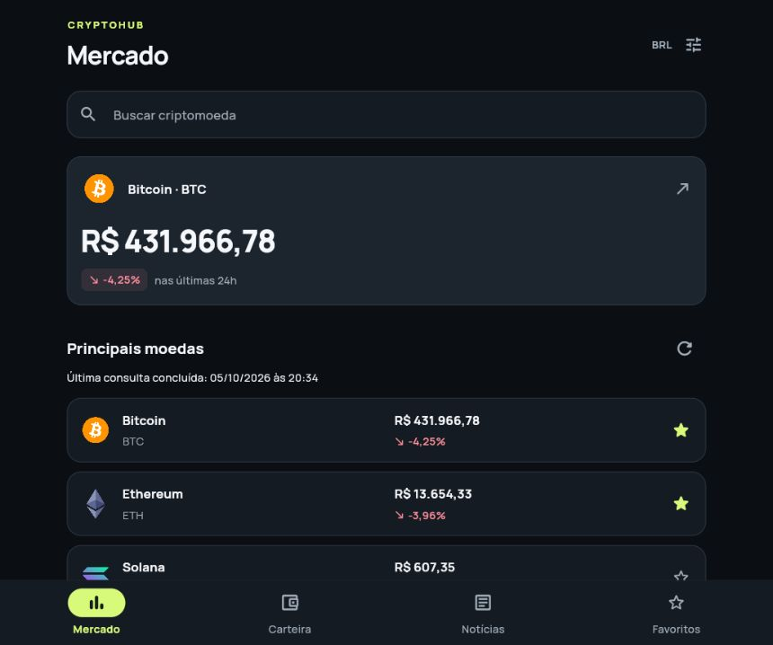

## Carteira

Total estimado e posições de exemplo.

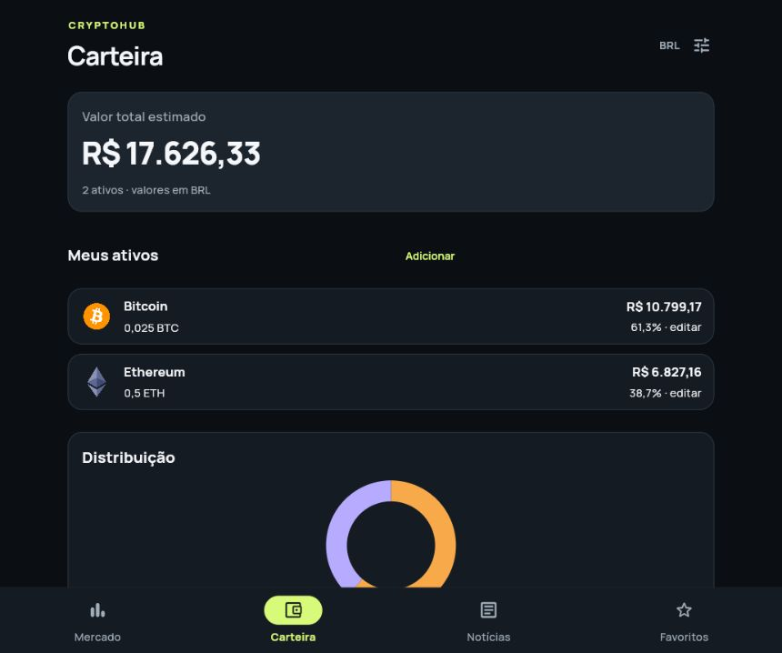

Distribuição do valor entre Bitcoin e Ethereum.

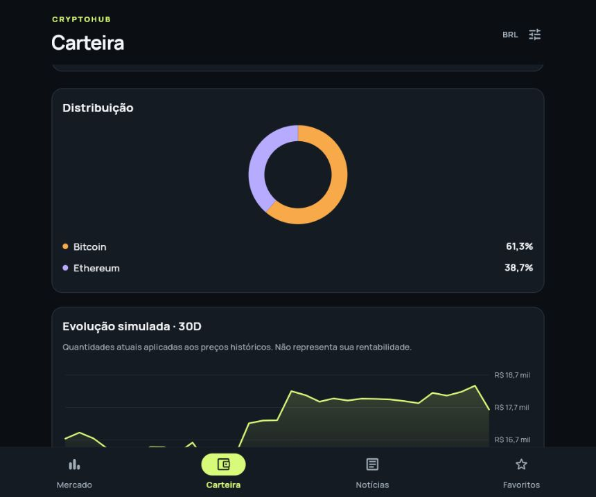

Evolução simulada em 30 dias, usando as quantidades atuais e os preços históricos.

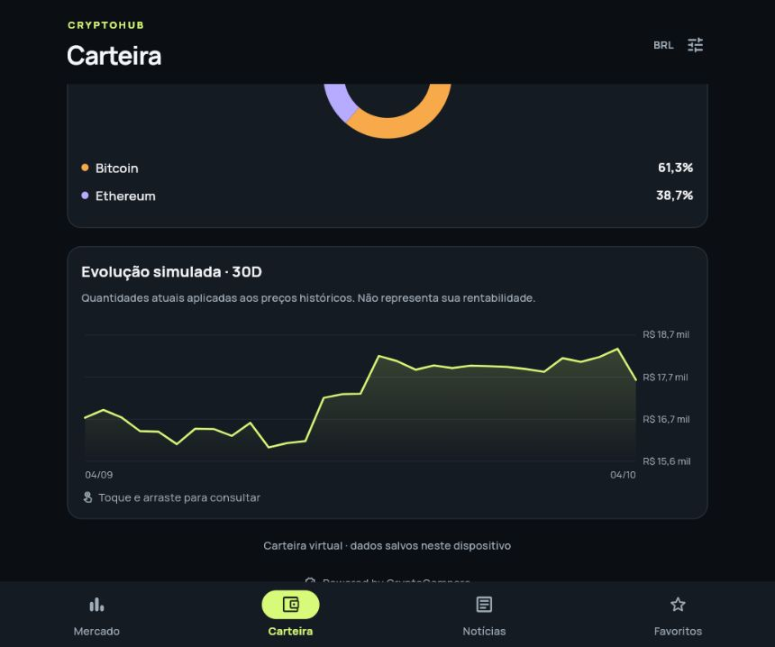

Estado da carteira antes de adicionar ativos.

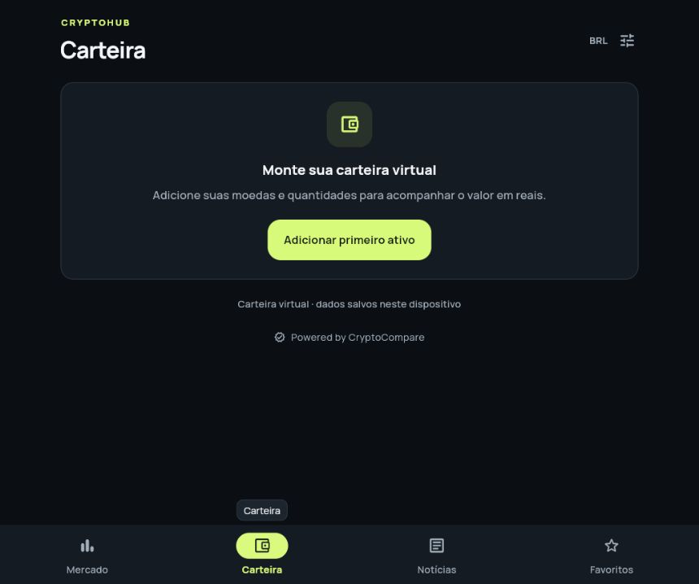

## Notícias

Publicações retornadas pela API, com fonte, data, resumo e acesso ao link original. A leitura da fonte abre no navegador externo; não há uma tela interna de artigo.

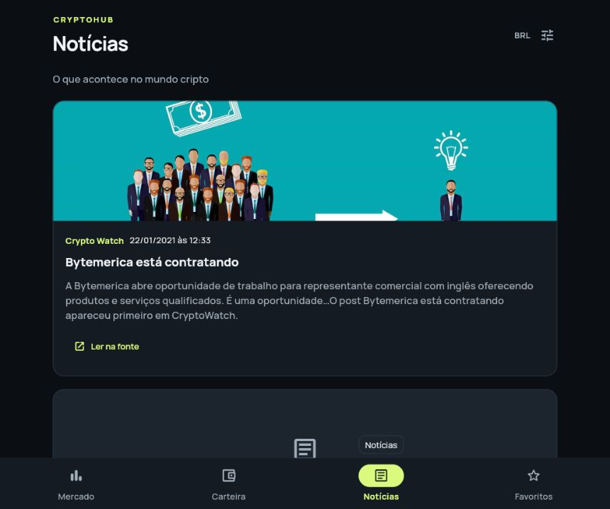

## Favoritos

Bitcoin e Ethereum marcados como favoritos, com pesquisa local.

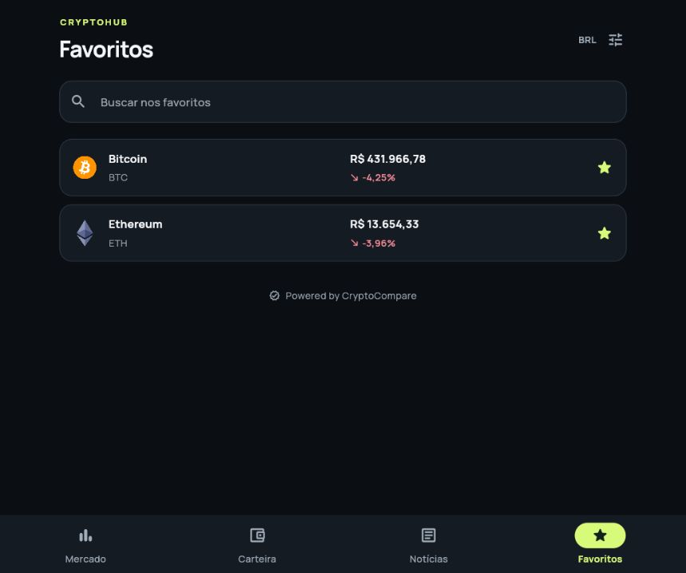

## Buscar criptomoeda

Busca por símbolo no catálogo; exemplo com BTC.

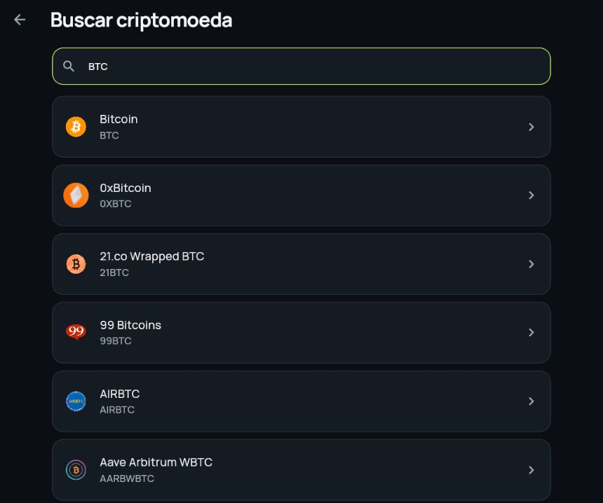

## Detalhes da moeda

Bitcoin com preço, variação e gráfico de 30 dias. Também estão disponíveis os períodos 1D, 7D, 90D e 1A.

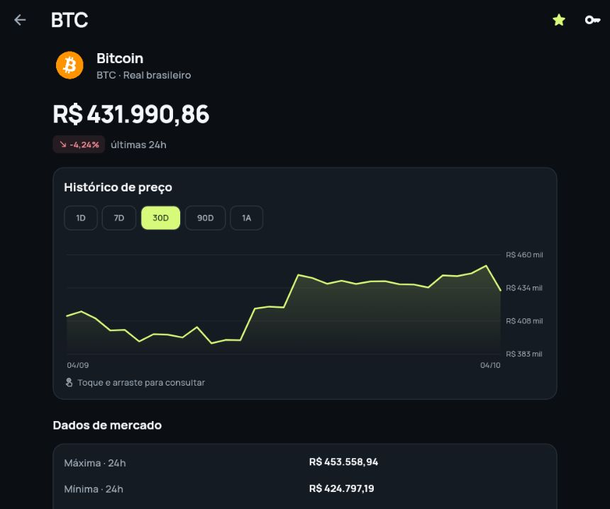

Continuação da tela: máxima, mínima, abertura, volumes, capitalização, oferta, mercado, atualização e botão para adicionar à carteira.

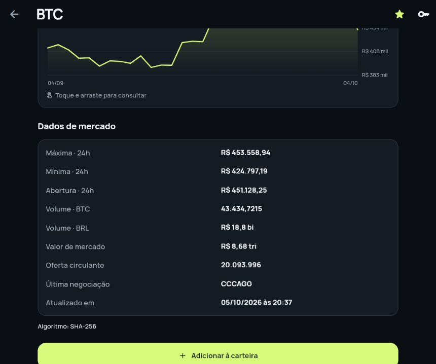

## Adicionar ativo

Formulário inicial para selecionar a moeda e informar a quantidade.

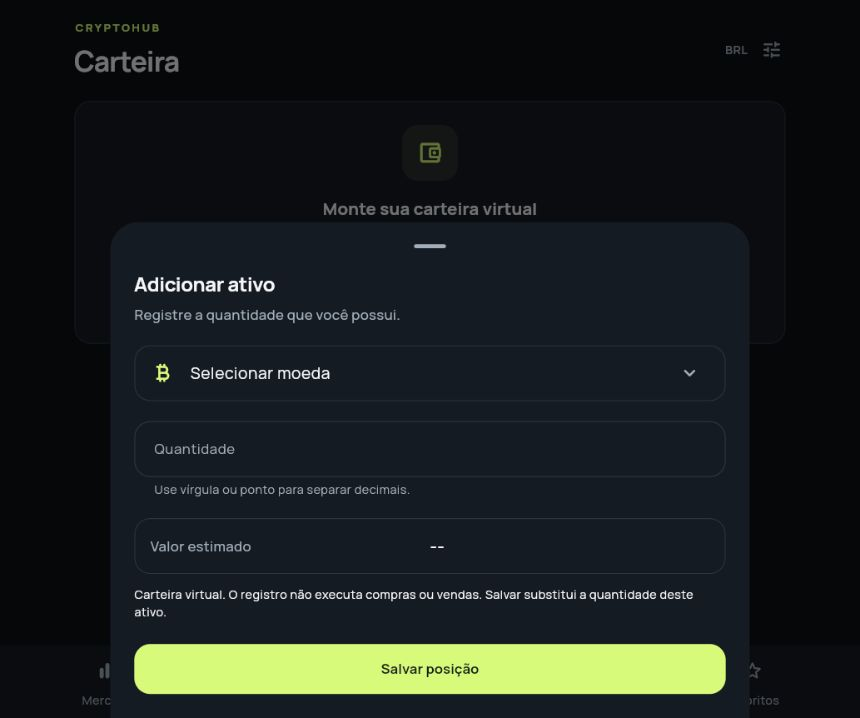

Formulário preenchido com uma quantidade de exemplo e seu valor estimado.

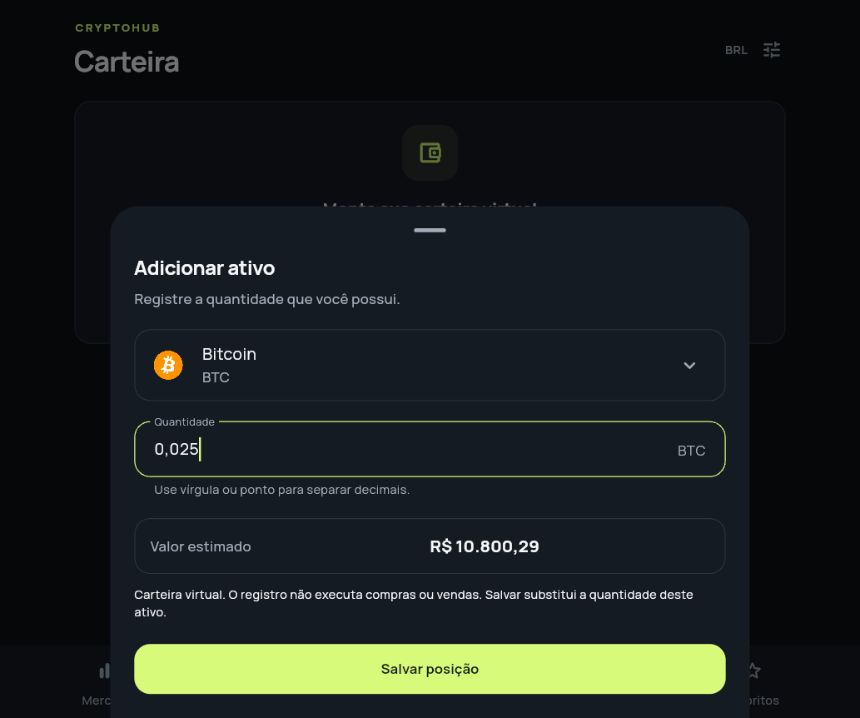

## Configurar API

Formulário de acesso à CryptoCompare, capturado com o campo da chave vazio.

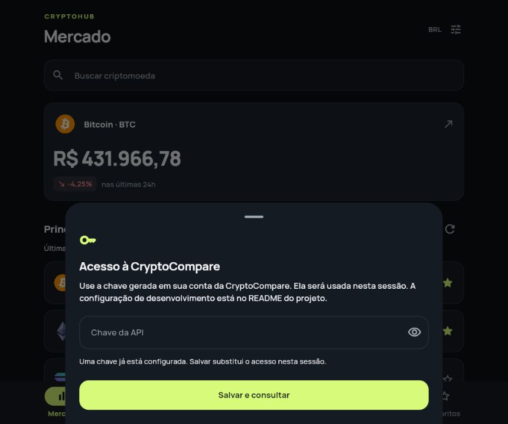

## Selecionar moeda

Seleção de uma moeda para o formulário da carteira.

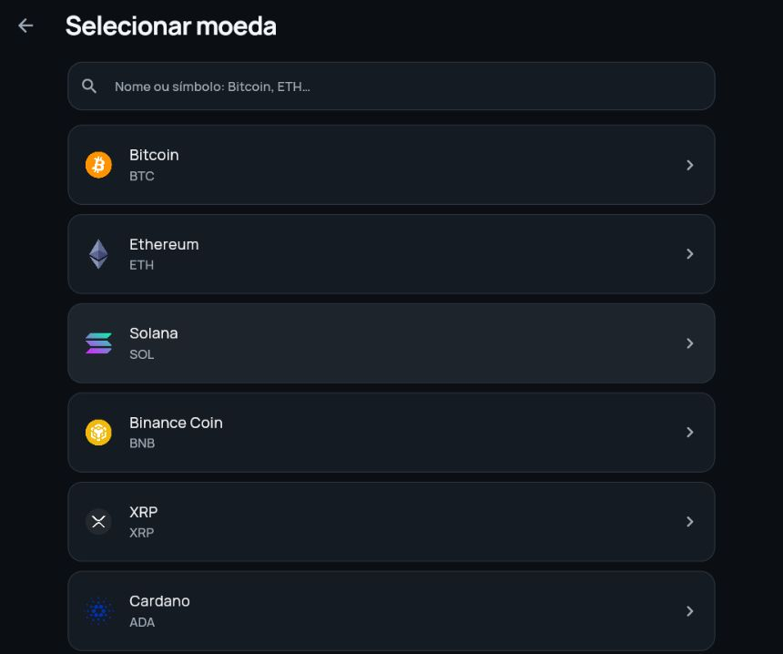

## Editar posição

Quantidade da posição existente, valor estimado e opção para remover o ativo.

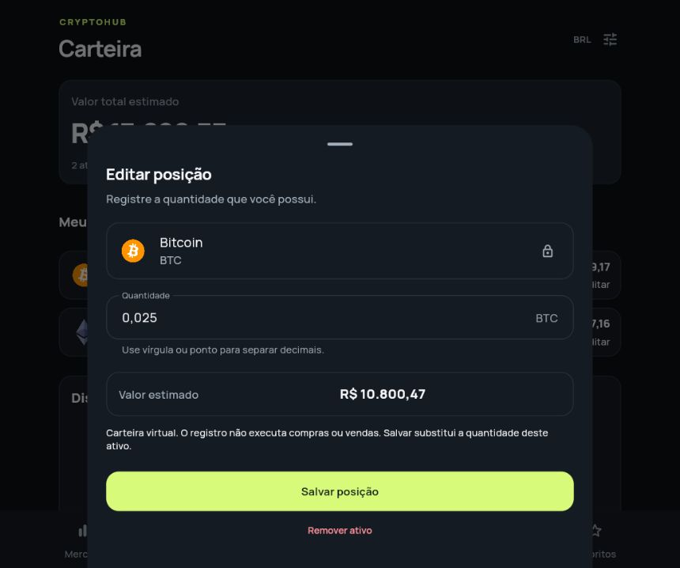

## Confirmar remoção

Diálogo de confirmação antes de remover uma posição. A operação foi cancelada após a captura.

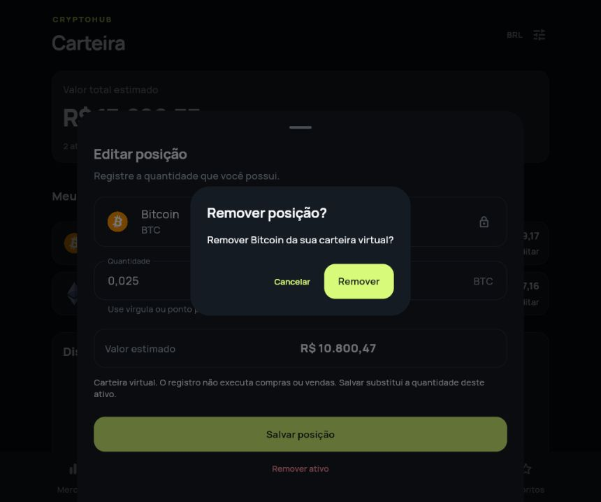

Os arquivos originais estão na pasta [prints](prints). Consulte também o [resumo da entrega](ENTREGA.md) e a [lista de pendências](PENDENCIAS.md).
